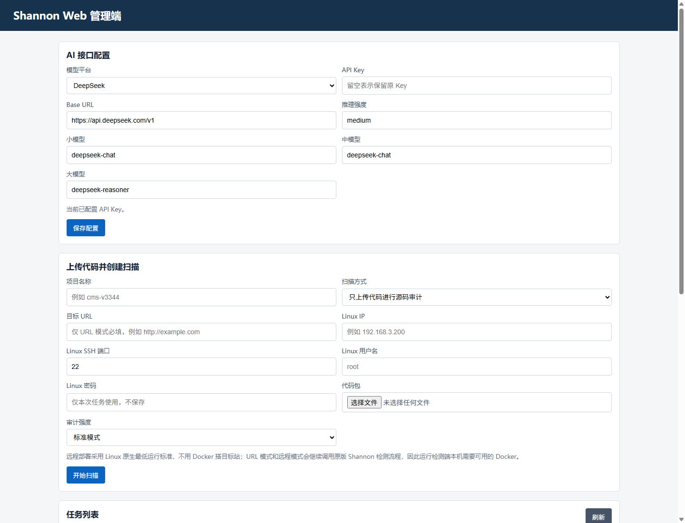
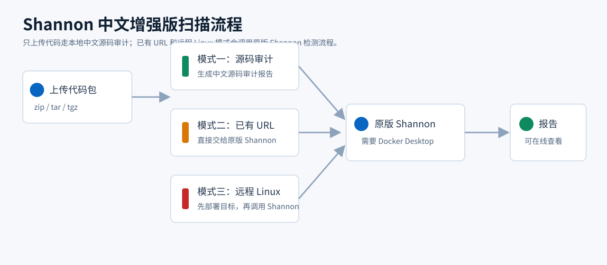

# Shannon 中文增强版新手使用说明

这份文档给第一次使用的人看。原版 Shannon 的完整英文说明请参考：

[https://github.com/KeygraphHQ/shannon](https://github.com/KeygraphHQ/shannon)

本 fork 主要增加了中文 Web 管理端、国内常见大模型配置、远程 Linux 部署和中文报告下载。



## 一句话理解

你可以把它当成一个本地 Web 工具：

1. 先配置 AI API。
2. 上传源码压缩包。
3. 选择扫描方式。
4. 看实时进度。
5. 下载报告。

## 运行前准备

建议在 Windows 上准备这些东西：

- Node.js 18+
- pnpm
- Docker Desktop
- 一个 AI API Key，例如 DeepSeek、OpenAI 或 OpenAI 兼容接口
- 如果要用远程部署模式，再准备一台 Linux 虚拟机

安装依赖：

```powershell
pnpm install
```

构建项目：

```powershell
pnpm build
```

## 启动 Web 管理端

在项目根目录运行：

```powershell
powershell -ExecutionPolicy Bypass -File .\start-web.ps1
```

打开浏览器访问：

```text
http://127.0.0.1:8787
```

## 先配置 AI

在页面顶部选择模型服务商，然后填写 API Key。

支持的服务商包括：

- DeepSeek
- 通义千问 Qwen
- 智谱 GLM
- Moonshot Kimi
- 百川智能
- MiniMax
- 豆包 / 火山方舟
- 零一万物 Yi
- 硅基流动
- OpenAI / GPT
- OpenAI 兼容接口
- Anthropic

填写后点击“保存配置”。配置会保存在本地 `.env`，不要把 `.env` 提交到 GitHub。

## 三种扫描方式



### 方式一：只上传代码进行源码审计

适合：

- 第一次试用
- 还没有搭好网站
- 只想快速看源码风险线索

会生成：

```text
source_code_audit_report.md
summary_report.md
task.log
```

### 方式二：已有 URL

适合：

- 你已经自己搭好了目标网站
- 有公网或内网 URL

需要填写：

```text
目标 URL
代码包
```

这个模式会调用原版 Shannon 检测流程，因此本机 Docker Desktop 必须正常启动。

### 方式三：远程 Linux 部署

适合：

- 你有一台 Linux 测试机
- 希望工具自动上传代码并尝试启动目标

需要填写：

```text
Linux IP
SSH 端口
Linux 用户名
Linux 密码
代码包
```

流程是：

1. Web 后端 SSH 到 Linux。
2. 上传并解压代码包。
3. 按最低运行标准尝试启动目标。
4. 拿到目标 URL。
5. 把 URL 交给原版 Shannon 检测流程。

这个模式不使用 Docker 来搭建目标站，但检测阶段仍然需要本机 Docker Desktop，因为原版 Shannon worker 依赖 Docker。

## 报告下载

任务完成后，在 Web 页面点击“下载”。

本地也可以在这里找：

```text
workspaces\<任务名>\deliverables\
```

常见报告：

```text
remote_deployment_diagnosis.md
target_url_diagnosis.md
source_code_audit_report.md
comprehensive_security_assessment_report.md
summary_report.md
```

不同扫描方式生成的报告不同，这是正常的。

## Docker 问题排查

如果后两种模式失败，并提示：

```text
Docker Desktop 未启动或 Docker Engine 不可用
```

先打开 Docker Desktop，等待它显示 Engine running。

检查 Docker：

```powershell
docker version
docker info
docker ps
```

如果 Docker Desktop 已经打开但还是失败，检查 WSL：

```powershell
wsl --status
```

如果提示未安装 WSL，用管理员 PowerShell 执行：

```powershell
wsl --install
```

然后重启电脑，再打开 Docker Desktop。

## 常见问题

### 只想先试一下，选哪个模式？

选“只上传代码进行源码审计”。这个模式最轻，不需要先搭网站。

### 为什么 URL 模式也要上传代码？

原版 Shannon 是白盒检测思路，需要同时知道目标 URL 和源码目录。

### 远程 Linux 模式会不会自动配置支付、短信、对象存储？

不会。当前采用最低运行标准，先尽量让目标站跑起来。复杂外部服务可以暂时缺省，报告里会保留诊断信息。

### API Key 会不会上传？

不会主动上传到 GitHub。它保存在本地 `.env`。请不要手动提交 `.env`。

## 授权提醒

只测试你自己拥有或已经获得明确授权的系统。不要扫描无授权目标，不要把真实客户数据、生产数据库、真实 API Key 放进公开仓库。
